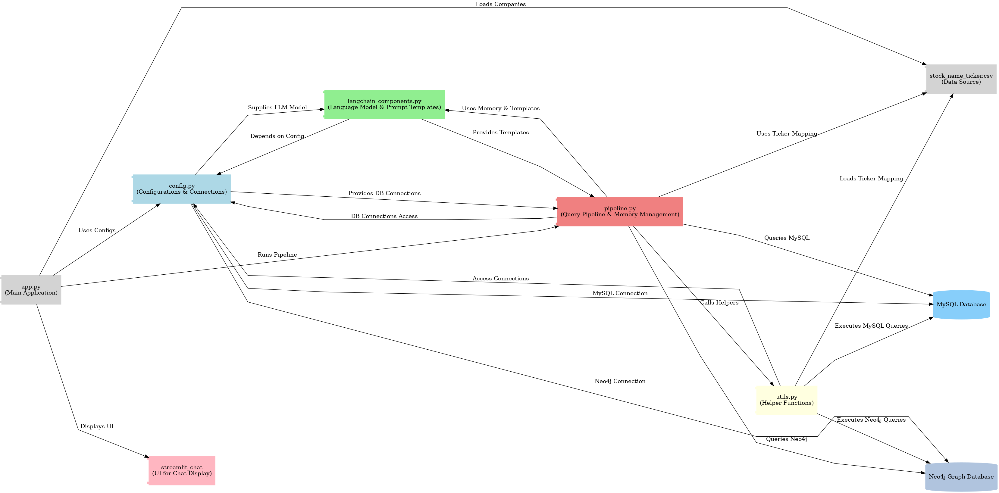

# Agentic RAG System for Stock Market Analysis

## Overview

The **Agentic RAG System for Stock Market Analysis** combines structured stock performance data with sentiment analysis from financial news, helping investors and analysts make better decisions. It uses **MySQL** for structured stock data and **Neo4j** for sentiment-tagged news, with a **LangChain-powered agentic RAG pipeline** for natural language querying and intelligent data retrieval.

## Key Features

- **Stock Trend Analysis**: Explore historical stock data to identify trends and patterns.
- **Sentiment Integration**: Combine stock data with news-based sentiment for richer insights.
- **Agentic RAG Workflow**: Uses LangChain to dynamically route, interpret, and rephrase queries for MySQL and Neo4j.
- **Memory-Enabled Conversations**: Maintains company-specific context for natural, follow-up questions.
- **Streamlit Interface**: Simple chat-based interface for querying and exploring stock information.

## Architecture

The system connects:
- **MySQL** → For structured historical stock data  
- **Neo4j** → For graph-based sentiment analysis  
- **LangChain Agent** → For natural language query processing and response generation  

## System Workflow



### Core Components

- `app.py` — Streamlit user interface for interaction  
- `pipeline.py` — Orchestrates query routing and response generation  
- `langchain_components.py` — LangChain prompts and memory setup  
- `utils.py` — Query execution and data utility functions  
- `config.py` — Secure connection setup for databases and model  

## How It Works

1. User asks a question via the Streamlit interface.  
2. LangChain interprets and routes the query:
   - **MySQL** → For numerical/trend-based stock queries.  
   - **Neo4j** → For sentiment/news-related insights.  
3. The system retrieves relevant data, generates a natural language response, and updates the conversation memory.  

## Run Locally

```bash
pip install -r requirements.txt
streamlit run app.py

```


 ## Demo Video

https://github.com/user-attachments/assets/13cd3ee0-ce64-4fe9-8de3-81e27218de13


